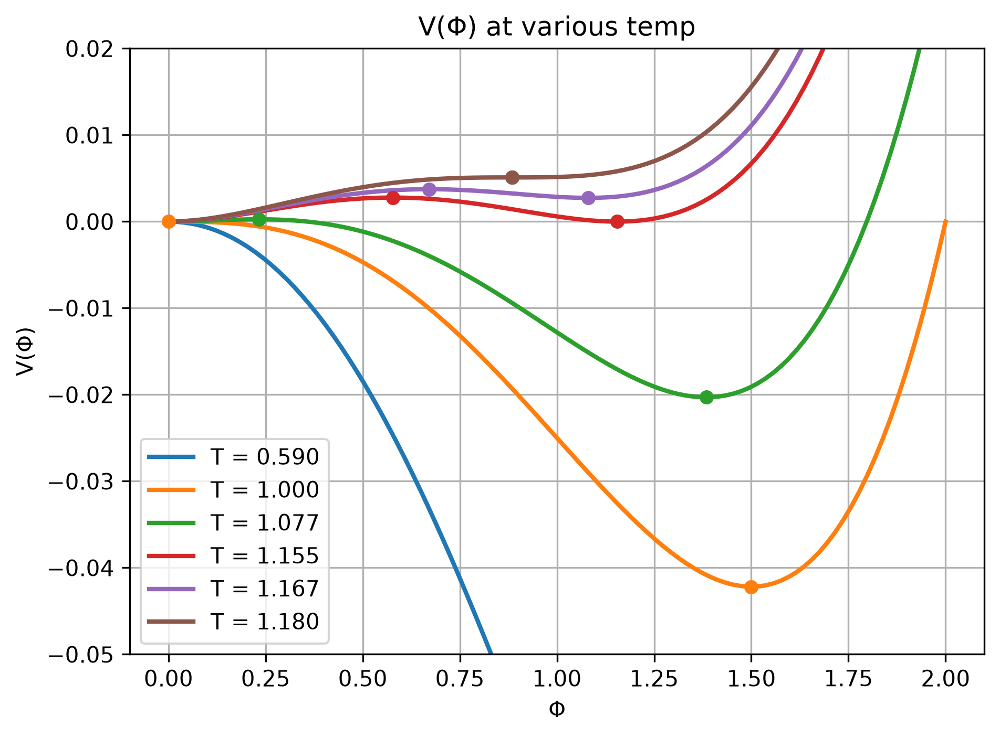
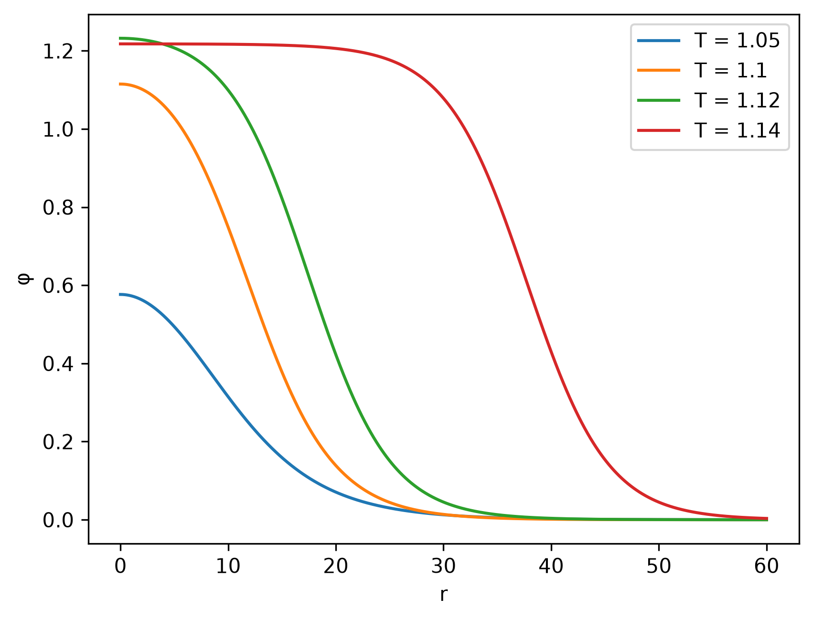
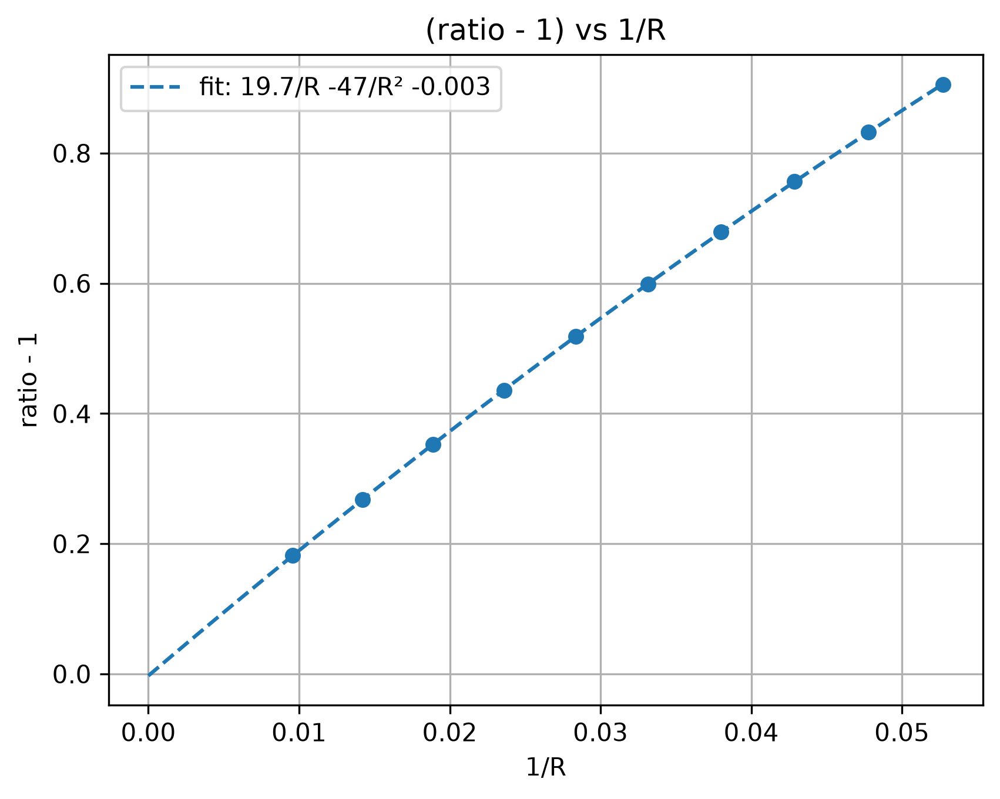

# Critical bubble (bounce) by the shooting method

A Python notebook that computes the critical bubble of a first-order phase transition in a toy model and its nucleation action $S_3$, validates the result three independent ways, and (in progress) extracts the nucleation temperature and the transition-duration parameter $\beta/H$ that feed gravitational-wave predictions.

This is a learning project that reproduces a standard calculation, following [1] and [2]. It does not claim new physics.

## Checklist (what you can find here)

- [x] Derivation of the O(3)-symmetric bounce equation from the Euclidean action
- [x] Toy potential $V(\phi, T)$, its extrema, $T_1$ and $T_c$
- [x] ODE integrator for the bounce equation
- [x] Shooting (bisection) on $\phi(0)$ with overshoot / undershoot detection
- [x] Bubble profile $\phi(r)$ and action $S_3$
- [x] Validation: virial identity, convergence, thin-wall limit
- [ ] Cross-check against an existing code (e.g. CosmoTransitions)
- [ ] $S_3/T$ versus $T$, nucleation temperature $T_n$
- [ ] $\beta/H$ at $T_n$ (and $\alpha$ if included)

## Method

### The equation

#### Setup

At finite temperature the nucleation rate is controlled by a static, O(3)-symmetric critical bubble. Its action is

$$
S_3 = 4\pi \int_0^\infty r^2\, dr \left[\frac{1}{2}\left(\frac{d\phi}{dr}\right)^2 + V(\phi, T) \right],
$$

and the critical bubble is the profile $\phi(r)$ that makes $S_3$ stationary. The nucleation rate then goes roughly as $\Gamma \propto e^{-S_3/T}$.

#### Equation of motion

Varying the action gives

$$
\boxed{\;\phi'' + \frac{2}{r}\phi' = \frac{dV}{d\phi}\;}
$$

The factor $2/r$ comes from the three-dimensional Laplacian acting on an O(3)-symmetric profile. In a four-dimensional Euclidean (zero-temperature) treatment it would be $3/r$.

#### Boundary conditions

$$
\phi'(0) = 0, \qquad \phi(r \to \infty) = \phi_\text{f},
$$

where $\phi_\text{f} = 0$ is the false (symmetric) vacuum.

- $\phi'(0)=0$ keeps the solution regular at the centre of the bubble. It also makes the boundary term $r^2\phi'\,\delta\phi$ vanish at $r=0$.
- $\phi \to \phi_\text{f}$ means that far from the bubble the field sits in the metastable (false) vacuum. This also makes the boundary term vanish at infinity.

### The shooting method

#### The damped-particle picture

Imagine $r$ as time. Then the equation describes a particle moving in the **inverted potential** $-V(\phi)$, with a friction term $\frac{2}{r}\phi'$ that is strong at small $r$ and weak at large $r$.

- The particle is released at rest at $\phi(0)=\phi_0$, between the barrier top and the true (broken) minimum.
- It must come to rest exactly on the hilltop of $-V$ at $\phi_\text{f}$ as $r\to\infty$.
- If $\phi_0$ is too close to the true minimum, the particle loses too little energy to friction and **overshoots** $\phi_\text{f}$.
- If $\phi_0$ is too far from the true minimum, the particle loses too much energy and **undershoots**, turning back before it reaches $\phi_\text{f}$.
- The critical bubble corresponds to the $\phi_0$ between the two cases, found by bisection.

#### Starting the integration

The friction term is singular at $r=0$, so the integration starts at a small $r_0$. Near the centre, $\phi \approx \phi_0 + a r^2$. Substituting into the equation gives $6a = V'(\phi_0)$, so

$$
\phi(r_0) \approx \phi_0 + \frac{V'(\phi_0)}{6}\, r_0^2, \qquad
\phi'(r_0) \approx \frac{V'(\phi_0)}{3}\, r_0 .
$$

These values are the initial conditions passed to the ODE solver.

#### Numerical implementation

- `scipy.integrate.solve_ivp` with `rtol = 1e-10`, `atol = 1e-12` and dense output.
- Two terminal events classify each shot: **overshoot** when $\phi$ crosses 0 going down, **undershoot** when $\phi'$ turns positive. If neither fires before the integration limit, the shot is flagged as invalid.
- Bisection on $\phi_0$ between $\phi_-$ and $\phi_+$, with a bracket offset of $10^{-13}$ of the interval and an assertion that the two ends give undershoot and overshoot. The bisection stops when the interval is below `tol` $\times\,\phi_+$ (`tol` = $10^{-12}$, or $10^{-14}$ for $T \ge 1.145$).
- $S_3$ by the trapezoidal rule on $2\times10^5$ points, with the kinetic part $K$ and potential part $P$ computed separately.

### The potential

The standard toy model:

$$
V(\phi,T)=D(T^2-T_0^2)\phi^2-E\,T\,\phi^3+\frac{\lambda}{4}\phi^4 .
$$

Parameters (units $T_0 = 1$): $\lambda = 0.1$, $D = 0.1$, $E = 0.05$.

- For positive $D$, $E$ and $\lambda$ the potential has three extrema: $\phi = 0$ (the false vacuum), $\phi_-$ (the barrier top) and $\phi_+$ (the broken minimum). $\phi_\pm$ are the roots of $\lambda\phi^2 - 3ET\phi + 2D(T^2-T_0^2) = 0$.
- The nonzero extrema exist only below $T_1$, where the discriminant vanishes: $T_1^2 = 8\lambda D\,T_0^2 / (8\lambda D - 9E^2)$, which gives $T_1 \approx 1.1795$.
- **Critical temperature $T_c$**, where $V(\phi_+) = V(0)$. Here $V$ has a double root at $0$ and at $\phi_+$, which suggests the form

$$
V(\phi) = \frac{\lambda}{4}\,\phi^2(\phi-\phi_c)^2 .
$$

- Expanding and matching terms with the original form gives

$$
T_c^2 = \frac{T_0^2}{1 - E^2/(\lambda D)}, \qquad \phi_c = \frac{2E\,T_c}{\lambda},
$$

  so $T_c = \phi_c \approx 1.1547$ for these parameters.
- The wall tension at $T_c$ is $\sigma = \int_0^{\phi_c}\sqrt{2V}\,d\phi = \sqrt{\lambda/2}\;\phi_c^3/6 \approx 0.05738$.

Nucleation takes place for $T_0 < T < T_c$: the symmetric phase is metastable there, and the barrier at the origin persists down to $T_0$.



## Results

### Bubble profile



*$\phi(r)$ at four temperatures ($D = \lambda = 0.1$, $E = 0.05$, $T_0 = 1$).*

As $T \to T_c$, $\phi_0$ approaches $\phi_+$, the interior of the bubble becomes a plateau at the broken minimum, and the wall moves outward. This is the thin-wall picture. At lower $T$ the bubble stays small and its centre never reaches $\phi_+$.

| T | $\phi_0$ | $\phi_+$ | $\phi_0$ below $\phi_+$ by | $2\sigma/\varepsilon$ |
|------|--------|--------|------|------|
| 1.05 | 0.5765 | 1.4318 | 60%  | 4.1  |
| 1.10 | 1.1149 | 1.3355 | 17%  | 8.2  |
| 1.12 | 1.2321 | 1.2836 | 4%   | 13.3 |
| 1.14 | 1.2177 | 1.2181 | 0.03%| 32.5 |

### Action

| T | $S_3$ | $S_3/T$ | $\lvert K+3P\rvert$ |
|-------|-----------|-----------|---------|
| 1.05  | 7.74814   | 7.37919   | 4.0e-10 |
| 1.10  | 41.67990  | 37.89082  | 7.7e-10 |
| 1.12  | 93.24405  | 83.25362  | 2.3e-8  |
| 1.14  | 396.47923 | 347.78880 | 2.4e-7  |
| 1.145 | 821.25180 | 717.25048 | 5.2e-7  |
| 1.15  | 3090.8    | 2687.7    | 3.5e-2  |

At $T = 1.15$ the bubble is so large that $\phi_0$ lies within about $10^{-11}$ of $\phi_+$, so $S_3$ is quoted to five significant figures only (see Limitations).

## Validation

### Virial identity

Rescaling $r$ in the action ($\phi(r) \to \phi(r/\xi)$) changes the kinetic part $K = 4\pi\int r^2\,\tfrac12\phi'^2\,dr$ by a factor $\xi$ and the potential part $P = 4\pi\int r^2 V\,dr$ by $\xi^3$. Stationarity at $\xi = 1$ requires

$$
K + 3P = 0 \quad\Longrightarrow\quad S_3 = K + P = \tfrac{2}{3}K .
$$

This holds to $10^{-7}$ or better for $T \le 1.145$ (table above). It is a strong test, because it holds only if the profile solves the equation of motion for the potential actually used.

### Convergence

At $T = 1.12$, varying the solver tolerance (bisection tolerance fixed at $10^{-12}$):

| rtol | $S_3$ | difference from rtol = 1e-12 | $K+3P$ |
|-------|----------------|---------|----------|
| 1e-6  | 93.24407045    | 1.7e-5  | -5.2e-4  |
| 1e-8  | 93.24405351    | 2.1e-7  | -3.4e-6  |
| 1e-10 | 93.24405330289 | 2.5e-9  | -2.0e-8  |
| 1e-12 | 93.24405330043 | —       | -7.9e-10 |

The error in $S_3$ scales close to linearly with rtol, and $S_3 = K+P$ converges faster than $\tfrac{2}{3}K$, since the action is stationary at the true solution. At the default rtol = $10^{-10}$, $S_3$ is converged to about $3\times10^{-11}$ relative.

Varying the starting radius $r_0$ at the default tolerance:

| $r_0$ | $S_3$ | shift from $r_0 = 10^{-5}$ | $\tfrac{4\pi}{3}\lvert V(\phi_0)\rvert r_0^3$ |
|--------|----------------|---------|---------|
| 1e-5   | 93.24405330288 | —       | —       |
| 3.3e-3 | 93.24405330430 | 1.4e-9  | 1.3e-9  |
| 6.7e-3 | 93.24405331356 | 1.07e-8 | 1.06e-8 |
| 1e-2   | 93.24405333868 | 3.6e-8  | 3.6e-8  |

The dependence on $r_0$ is exactly the omitted core integral from $0$ to $r_0$, $\tfrac{4\pi}{3}V(\phi_0)r_0^3$. At the default $r_0 = 10^{-4}$ it is about $4\times10^{-11}$ and negligible.

### Thin-wall limit

Close to $T_c$ the action should approach the thin-wall result

$$
S_{3,\text{thin}} = \frac{16\pi\sigma^3}{3\varepsilon^2}, \qquad \varepsilon(T) = -V(\phi_+, T),
$$

with bubble radius $R = 2\sigma/\varepsilon$ and $\sigma$ evaluated at $T_c$.

| T | $S_3$ | $S_{3,\text{thin}}$ | ratio | (ratio − 1)·R | `rend` | $2\sigma/\varepsilon$ |
|-------|----------|----------|--------|-------|-------|-------|
| 1.130 | 164.735  | 86.434   | 1.9059 | 17.18 | 97.9  | 19.0  |
| 1.132 | 192.882  | 105.269  | 1.8323 | 17.42 | 97.3  | 20.9  |
| 1.134 | 229.739  | 130.795  | 1.7565 | 17.65 | 97.7  | 23.3  |
| 1.137 | 279.597  | 166.552  | 1.6787 | 17.87 | 103.9 | 26.3  |
| 1.139 | 349.843  | 218.754  | 1.5993 | 18.08 | 101.1 | 30.2  |
| 1.141 | 454.143  | 299.130  | 1.5182 | 18.28 | 108.9 | 35.3  |
| 1.143 | 620.278  | 432.005  | 1.4358 | 18.48 | 108.7 | 42.4  |
| 1.146 | 912.459  | 674.773  | 1.3522 | 18.66 | 118.0 | 53.0  |
| 1.148 | 1509.790 | 1190.971 | 1.2677 | 18.84 | 124.8 | 70.4  |
| 1.150 | 3090.812 | 2614.126 | 1.1824 | 19.02 | 146.9 | 104.3 |

Each point was accepted only if the integration ended beyond the bubble (`rend` > $2\sigma/\varepsilon$).



*Deviation from the thin-wall action versus $1/R$.*

The ratio falls toward 1 as $R$ grows. A quadratic fit in $1/R$ gives an intercept consistent with zero (about $-0.003$), so the data are consistent with $S_3/S_{3,\text{thin}} \to 1$ as $R \to \infty$ with a leading $1/R$ correction. The coefficient of the $1/R$ term also contains the temperature dependence of $\sigma$, which is not separated in this analysis.

## Limitations

- Toy polynomial potential, not a full thermal effective potential.
- No gauge dependence or higher-order thermal corrections.
- Single scalar field only.
- The shooting method becomes ill-conditioned near $T_c$: $\phi_0$ approaches $\phi_+$ to within $10^{-11}$ at $T = 1.15$, which limits both the closest temperature reached and the precision of $S_3$ there (five significant figures).
- The thin-wall comparison uses $\sigma$ at $T_c$ and does not separate wall-thickness corrections from the temperature dependence of $\sigma$.
- Not yet done: $T_n$, $\beta/H$, and a cross-check against an existing code.

## How to run

```bash
git clone https://github.com/GriimHog/<repo-name>.git
cd <repo-name>
pip install -r requirements.txt
jupyter notebook notebook.ipynb
```

Requires Python 3 with `numpy`, `scipy`, `matplotlib` and `jupyter`.

## Repository layout

```
.
├── notebook.ipynb
├── requirements.txt
├── figures/
    ├──bubble_profile.png
    ├──phi0sol.png
    ├──ratio_1byR_behaviour.png
    └──V_at_various_Temp.png
├── LICENSE
└── README.md
```

## References

1. M. Hindmarsh, M. Lüben, J. Lumma, M. Pauly, *Phase transitions in the early universe*, arXiv:2008.09136.
2. D. Croon, D. J. Weir, *Gravitational waves from cosmological phase transitions* (review), arXiv:2410.21509.

## Author

Priyanshu Sharma, priyanshuaryan2002@gmail.com, priyanshus21@iiserb.ac.in
